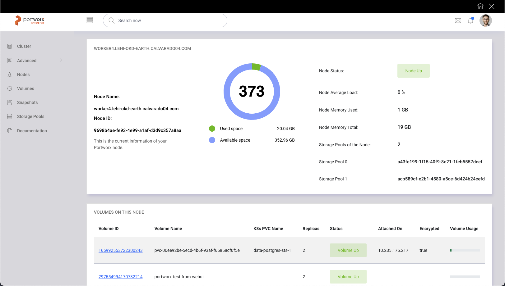

# portworx-client Web UI
A Portworx Client with Go with security enabled

- Built in Go version 1.19
- Uses [libopenstorage](https://github.com/libopenstorage/openstorage-sdk-clients) OpenStorage Portworx libraries
- Uses [gRPC](https://pkg.go.dev/google.golang.org/grpc) to consume the Portworx API
- Uses [gocloak](https://github.com/Nerzal/gocloak) for Keycloak auth security integration at Broker and Frontend levels.
- Uses [alex edwards](https://github.com/alexedwards/scs) SCS session manager
- Uses [chi router](https://github.com/go-chi/chi) to serve the pages
- Uses [nosurf](https://github.com/justinas/nosurf) for middleware operations

# Installation

You need a Portworx cluster already running on your cluster as prerequisite.

The `postgres.yaml` Statefulset is using the StorageClass `px-csi-db` present on Portworx 2.11 and 2.12 with CSI enabled; if you don't have it, please change it to a SC that your cluster have.

The `pxBrokerDeploy.yaml` Deployment have the `PORTWORX_GRPC_URL` environment variable configured to `kube-system`, change it if you have Portworx installed on a different namespace.

For Kubernetes install the yaml manifests: 

```
kubectl create namespace portworx-client

kubectl apply -f https://raw.githubusercontent.com/camartinez04/portworx-client/main/kubernetes/postgres.yaml -n portworx-client
kubectl apply -f https://raw.githubusercontent.com/camartinez04/portworx-client/main/kubernetes/keycloak.yaml -n portworx-client
kubectl apply -f https://raw.githubusercontent.com/camartinez04/portworx-client/main/kubernetes/pxBrokerDeploy.yaml -n portworx-client
kubectl apply -f https://raw.githubusercontent.com/camartinez04/portworx-client/main/kubernetes/pxFrontendDeploy.yaml -n portworx-client

```

Forward the service and open it on a web browser.

```
kubectl port-forward svc/pxfrontend-service -n portworx-client 8080:80

http://localhost:8080/portworx/ 

```

`User: pxadmin`

`Pass: pxAdmin123$`

Change your password on Keycloak, you can forward the Keycloak service and do it. 


# API Reference

The Broker service consumes the Portworx API on gRPC and serves a customized API Rest which reference can be found here:

[api documentation](https://documenter.getpostman.com/view/17794050/VUqpsxJW)

# Frontend view



# Docker Compose way for developing

You need Docker running on your laptop and docker-compose installed as well in advance.

```
cd project

make up_build

docker-compose ps

```

Create a test volume once the project is up, we will be using the mock service from OpenStorage as gRPC endpoint.

```
curl --location --request POST 'localhost:8080/postcreatevolume' \
--header 'Volume-Name: postman-volume' \
--header 'Volume-Size: 10' \
--header 'Volume-Ha-Level: 2' \
--header 'Volume-Encryption-Enabled: true' \
--header 'Volume-Sharedv4-Enabled: false' \
--header 'Volume-No-Discard: true'

```

Check on the frontend that the mock volume was created:

[http://localhost:8081/frontend/volume/postman-volume](http://localhost:8081/frontend/volume/postman-volume) 

# Test the Broker on Kubernetes (testing with a real Portworx cluster)

You need Portworx running on your Kubernetes cluster.

Forward the portworx-api service that usually will be located on kube-system namespace.

```
kubectl port-forward svc/portworx-api -n kube-system 9020:9020

export PORTWORX_GRPC_URL=localhost:9020

export KEYCLOAK_CLIENT_ID=<keycloak-client-id>
export KEYCLOAK_REALM=<keycloak-realm>
export KEYCLOAK_URL=<keycloak-url>
export KEYCLOAK_SECRET=<keycloak-secret>

cd portworx-client/broker

go run cmd/api/*.go

```

Open a Web Brower and try the routes included on broker/cmd/api/routes.go

# Test the Frontend on Development mode

You need the broker on your laptop or a valid endpoint where your broker is already running.

```
export BROKER_URL=http://localhost:8080

export KEYCLOAK_CLIENT_ID=<keycloak-client-id>
export KEYCLOAK_REALM=<keycloak-realm>
export KEYCLOAK_URL=<keycloak-url>
export KEYCLOAK_SECRET=<keycloak-secret>

cd portworx-client/frontend

go run cmd/web/*.go

```

Open a browser and navigate into:

[http://localhost:8081/frontend/cluster](http://localhost:8081/frontend/cluster) 
